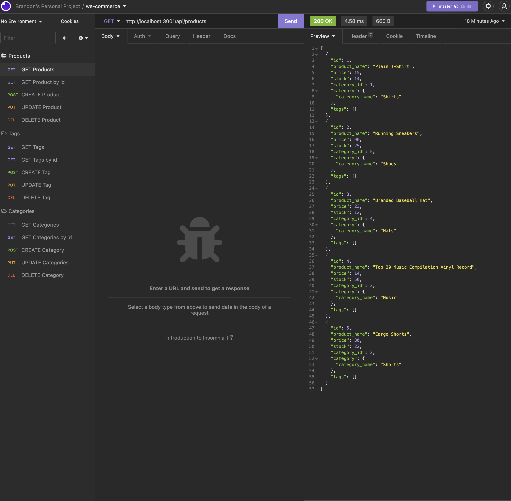

# We Commerce

We Commerce is a back end for an e-commerce website that uses a MySQL database to allow the company to compete with other e-commerce comanies.

## Installation

To run this app on your local machine, you will want to clone this repository and install MySQL and Node. Then, open your terminal and type in "npm install" to install npm packages. The screenshot above shows CRUD requests in Insomnia, which is a cross-platform application that serves as a REST API client. I recommend installing Insomnia to test out We Commerce.

## Usage

* Navigate to the root folder in your terminal
* Start MySQL and type in "SOURCE ./db/schema.sql;" then "USE ecommerce_db;"
* Seed the database by typing in "npm run seed" and then start the server with "npm start" 
* Open insomnia and make GET, POST, PUT, and DELETE requests to interact with database

Click [here](https://drive.google.com/file/d/1REgwEma6zTLoFbzztMOgsabxWZS06Dkt/view) to watch an instructional video

## Technologies

* Javascript
* MySQL
* Express.js
* Sequelize
* Node.js

## Contributers

* Brandon Henry
